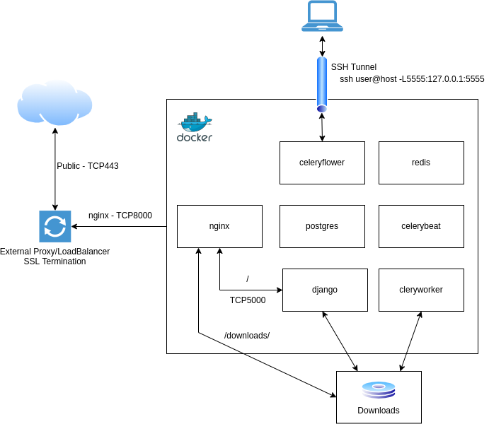

 .. _behind-proxy:

ViddlWS behind an external reverse proxy/loadbalancer
======================================================================

For users wanting to run ViddlWS on a system directly exposed to the Internet,
like on VPS and so on please refer to the :ref:`public-facing` documentation.

An external reverse proxy could be a webserver like nginx, a loadbalancer could
be haproxy or a hardware appliance which sits in front of a backend service
like ViddlWS.
It serves as the public facing endpoint for the backend services and forwards
user requests to the backend services.

Typically a reverse proxy and also loadbalancer services terminates SSL.

At the time of writing a deployment using docker-compose is available in the repository.
See the documentation for this setup further down.

====================
With docker-compose
====================

To bring up ViddlWS with docker-compose use production-behind-proxy.yml.

This will bring up various containers, the main entrypoint container for the external
proxy or loadbalancer is the nginx container which exposes its services on TCP8000 on all interfaces
of the host on which Docker is installed.

It is expected that the external proxy or loadbalancer handles the SSL termination.

To better understand the setup please have a look at the graphical representation of the intended setup:

Please note: The communication between the external proxy or loadbalancer and
the nginx container is unencrypted. If encryption is needed at this stage the
users installing ViddlWS need to implement a solution themselves.

To configure ViddlWS refer to the common :ref:`prod-settings` documentation.

========================
Access to Celery Flower
========================

Celery Flower is a webinterface to access the Celery status. As per Flowers documentation
it should be avoided to make it accessable from the internet.
Therefore the Flower docker container only listens on 127.0.0.1 on the docker host.

To access the webui open an SSH tunnel with the command:

.. code-block:: bash

   ssh user@dockerhost -L5555:127.0.0.1:5555
